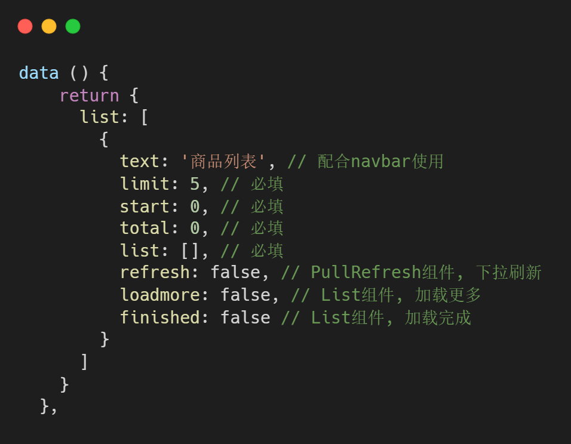

# LoadList类

> vant版的加载列表类：具有首次加载，下拉刷新，上拉加载功能，配合 List 组件与 PullRefresh 组件使用
>
> 因为是以公司后端接口为模板来设计的，所以通用性并不高，属于自用性质

### 初始化：

```js
  /**
   * 初始化LoadList类
   * @param {Array} list 传入列表，要求是个数组，以实现多列表模式
   * @param {Function} handle 传入一个Promise封装的请求方法
   */
  // list模板
  list: [
    {
      text: '商品列表', // 配合navbar使用
      limit: 5, // 必填
      start: 0, // 必填
      total: 0, // 必填
      list: [], // 必填
      refresh: false, // PullRefresh组件, 下拉刷新
      loadmore: false, // List组件, 加载更多
      finished: false // List组件, 加载完成
    }
  ]
```



### 使用：


### 方法：

#### onLoad

```js
  /**
   * 下拉刷新方法
   * @param {Number} index 传入index选择要加载的列表，默认为第一个
   */
```

#### onRefresh

```js
  /**
   * 加载列表方法
   * @param {Number} index 传入index选择要加载的列表，默认为第一个
   */
```

